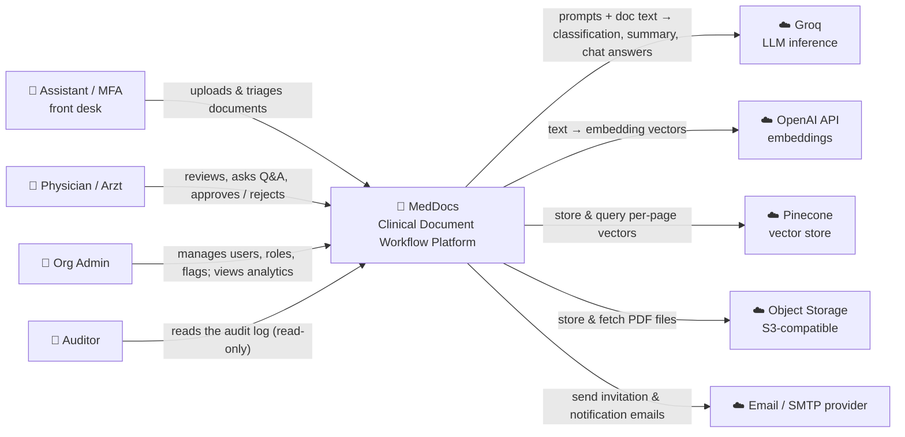
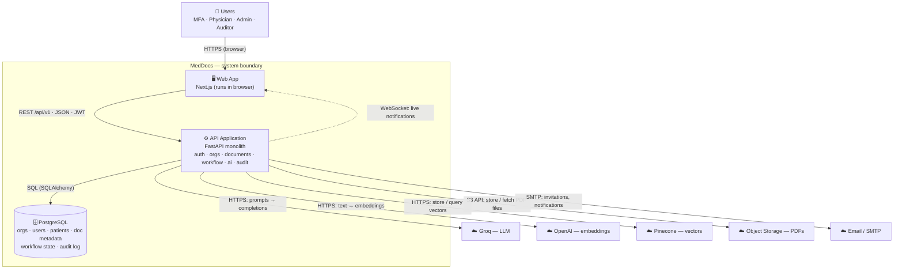

# MedDocs — Architecture

> The shape of the system, drawn before the code. Uses the **C4 model** — we draw the top two
> zoom levels: **Level 1 (System Context)** and **Level 2 (Container)**.
> Source of truth for who touches the system and what the runtime pieces are. Personas and journeys
> come from [`PRODUCT.md`](../PRODUCT.md).

---

## Level 1 — System Context

**The question this answers:** *who and what touches MedDocs, and why?*

**Rules of this level:**
- **One box** = the MedDocs software system (the thing we build and run). We do **not** open it here.
- **People** (all four personas) stand **outside** the box — a human is never "inside" software.
- **External systems** = third-party services we **do not run** (we call their APIs).
  Vendors are named loosely here; the specific choice lives in the tech-choice table and ADRs.
- **PostgreSQL is NOT on this diagram** — we run it ourselves, so it's *inside* the box (it appears at Level 2).

**Arrows, in words** (every line is labelled with what flows):

| From | To | What flows | Direction (who initiates) |
|---|---|---|---|
| Assistant / MFA | MedDocs | uploads & triages documents | person → system |
| Physician | MedDocs | reviews, Q&A, approve/reject | person → system |
| Org Admin | MedDocs | manages users, roles, flags; analytics | person → system |
| Auditor | MedDocs | reads audit log (read-only) | person → system |
| MedDocs | Groq | doc text + prompts → classification, summary, chat | system → external |
| MedDocs | OpenAI | text → embedding vectors | system → external |
| MedDocs | Pinecone | store + similarity-query per-page vectors | system → external |
| MedDocs | Object Storage | store + fetch PDF files | system → external |
| MedDocs | Email/SMTP | send invitation & notification emails | system → external |

> **Boundary rule of thumb:** if *we* run it → inside the box (Postgres). If a third party runs it and
> we call their API → outside the box (Groq, OpenAI, Pinecone, Object Storage, Email).

---

## Level 2 — Container Diagram

**The question this answers:** *what are the separately-running pieces inside MedDocs, and how do they talk?*

A **container** here = a separately-running process or datastore (**not** a Docker container). Today: **three** —
a **Next.js web app**, a **FastAPI backend** (deliberate monolith, [ADR-001]), and **PostgreSQL**. Arrows now
carry the **protocol**.

**Key property — the frontend talks to nothing but the API.** All external calls (Groq, OpenAI, Pinecone,
Storage, Email) originate from the **backend**. API keys and secrets live only on the server, **never in the
browser**. That single rule is a security decision, not an accident.

> **Planned (M6, not built yet):** a **background worker** + **Redis** queue for the async AI pipeline —
> two more containers, added only when the jobs justify them ([ADR to follow]). Redis/worker deferred on purpose.

---

## Tech-choice table

Each major choice, one-line "why", and the ADR that argues it in full (ADRs written in ENG-16).

| Layer | Choice | Why | ADR |
|---|---|---|---|
| Backend framework | **FastAPI** | async, Pydantic validation, auto OpenAPI docs; the standard in AI/ML shops | — |
| Architecture | **Monolith** (one modular FastAPI app) | one deployable; microservices add ops cost with no payoff at this scale | ADR-001 |
| Relational DB | **PostgreSQL** | transactions + `FOR UPDATE SKIP LOCKED` for work queues, JSONB, full-text search | ADR-002 |
| Multi-tenancy | **Shared DB, org-scoped rows** | proven isolation without per-tenant database overhead | ADR-002 |
| Auth | **JWT (stateless)** | no server session store → scales horizontally; server recomputes the signature with `SECRET_KEY` | ADR-003 |
| Vector store | **Pinecone** | managed — no vector infra to run; recognised by employers | — |
| LLM inference | **Groq** | free + fast for dev and the demo; provider-swappable | — |
| Embeddings | **OpenAI `text-embedding-3-small`** | industry-standard, cheap, good enough; embeddings-only spend | — |
| File storage | **Object storage** (R2 / MinIO, S3 API) | PDFs don't belong in Postgres; cheap, scalable blob storage | ADR-005 |
| Feature flags | **In-house, per-tenant** | per-tenant rollout incl. % rollout of new AI prompt versions | ADR-004 |
| Frontend | **Next.js + Tailwind** | RSC/SSR, strong DX; the biggest edge over Python-only candidates | — |
