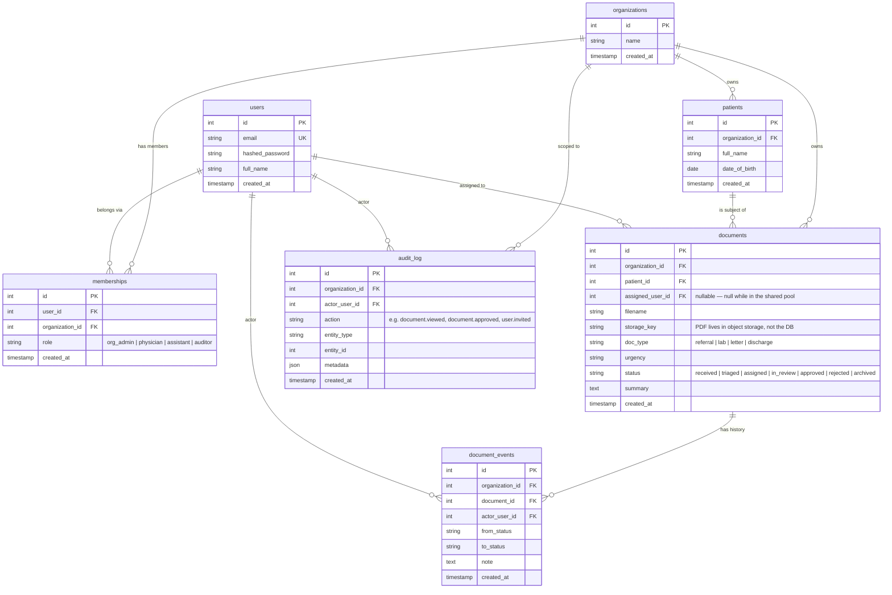

# MedDocs — Data Model (ERD)

> **Status: FIRST DRAFT (ENG-12, in progress).** Captures the core entities decided in the design
> session. Secondary tables and index review still to do — see "Open / next" at the bottom.
> This is the **target** schema for the multi-tenant platform. The current `backend/app/models.py`
> is the OLD single-user schema (User, Document, ChatSession, ChatMessage) — do not reuse it; M2 implements this.

## The one rule: multi-tenancy at the schema level

Every table that holds a tenant's data carries an **`organization_id`** column. That column is what
guarantees org A can never read org B's rows. **The single exception is `users`** — a user is a
**global identity** (one login), tied to organizations through `memberships`, so it has no `organization_id`.

## Core ERD

## Two decisions worth defending in an interview

**1. `memberships` is a join table — `role` is NOT a column on `users`.**
`users` ↔ `organizations` is **many-to-many** (a user can belong to several orgs; an org has many users).
A many-to-many is always resolved with a **join table**, and the **role is data about the link**, so it
lives on `memberships`. This lets one person be a *physician at Clinic A and an auditor at Clinic B* —
impossible if `role` sat on the `users` row.

**2. `document_events` and `audit_log` are two different tables.**
- `document_events` = *what happened to the document* — one row per **state change** (`from_status → to_status`). Powers the timeline.
- `audit_log` = *who touched what, everywhere* — one row per **sensitive action, including reads**. Append-only, for the auditor (DSGVO).
- The proof they're different: a physician **opening** a document changes no state → **nothing** in `document_events` → but it **must** appear in `audit_log`. Written at event time ("record it when it happens").

## Indexes we already know we'll need

- `documents (organization_id, status)` — the work-queue query ("open docs of this status in my org").
- `memberships (user_id)` and `memberships (organization_id)` — resolve who's in what.
- `audit_log (organization_id, created_at)` — the auditor's filtered time-range reads.
- `document_events (document_id, created_at)` — a document's timeline.

## Open / next (decisions still Mohamad's to make)

- **Secondary tables not yet designed:** `comments` (physician notes), `lab_values` (structured trends),
  `notifications`, and the chat tables (`chat_sessions`, `chat_messages`) carried over from the old schema.
- **PK type:** `int` autoincrement vs `uuid` — has a real multi-tenant security angle (guessable IDs). Decide with an ADR.
- **Cardinality review:** confirm every relationship line and its nullability.
- Then: `/commit` on the `ENG-12-erd` branch → PR → **set the correct squash title at merge**.
