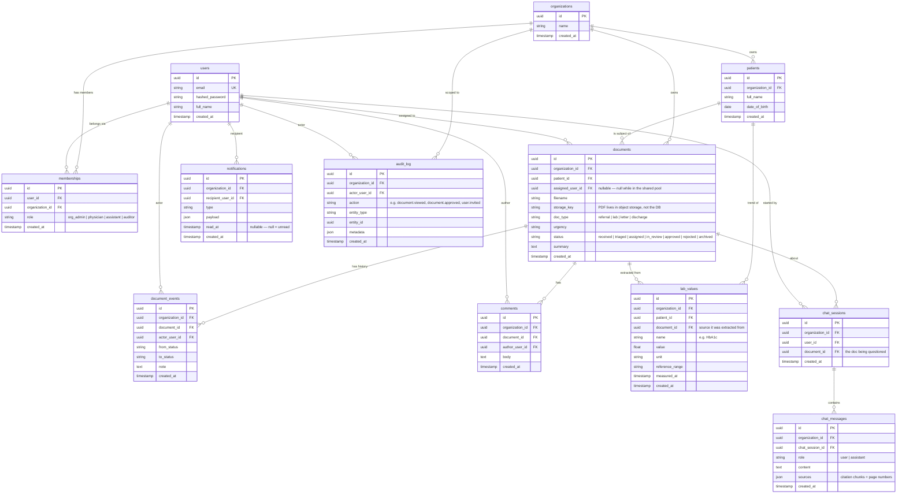

# MedDocs — Data Model (ERD)

> **Status: complete for M1.** The target data model for the multi-tenant platform. The current
> `backend/app/models.py` is the OLD single-user schema (User, Document, ChatSession, ChatMessage) —
> do not reuse it; M2 implements this.

## Two rules that govern the whole schema

1. **Multi-tenancy:** every table that holds a tenant's data carries an **`organization_id`** column —
   including child tables like `chat_messages`. This makes tenant isolation a **uniform filter**
   (`WHERE organization_id = me`) that never depends on remembering a JOIN, and it's ready for
   Postgres row-level security. **The one exception is `users`** — a global identity (one login),
   tied to orgs through `memberships`.
2. **Primary keys are `uuid`** — non-enumerable, so IDs in URLs don't leak record identity or volume.
   Isolation is still enforced by `organization_id`, never by ID obscurity. (See ADR-002.)

## ERD

> **Note:** `organization_id` (FK → `organizations`) sits on **every** table except `users`. To keep the
> diagram readable, only the primary ownership lines from `organizations` are drawn; the tenancy FK is
> listed in each table's attributes.

## Two decisions worth defending in an interview

**1. `memberships` is a join table — `role` is NOT a column on `users`.**
`users` ↔ `organizations` is **many-to-many**; a many-to-many is resolved with a **join table**, and the
**role is data about the link**, so it lives on `memberships`. Lets one person be a physician at Clinic A
and an auditor at Clinic B — impossible with `role` on `users`.

**2. `document_events` vs `audit_log` are two different tables.**
- `document_events` = *what happened to the document* — one row per **state change**. The timeline.
- `audit_log` = *who touched what, everywhere* — one row per **sensitive action, including reads**. Append-only.
- Proof: a physician **opening** a document changes no state → **nothing** in `document_events` → but it **must** appear in `audit_log`.

## Indexes we already know we'll need

- `documents (organization_id, status)` — the work-queue query.
- `memberships (user_id)` and `memberships (organization_id)` — resolve who's in what.
- `audit_log (organization_id, created_at)` — the auditor's time-range reads.
- `document_events (document_id, created_at)` — a document's timeline.
- `lab_values (patient_id, name, measured_at)` — a patient's trend for one lab value.
- `notifications (recipient_user_id, read_at)` — a user's unread notifications.

## Deferred (later milestones)

- `invitations` and `feature_flags` — modelled when M2/M4 build those features.
- PK type and tenancy model are captured in **ADR-002**.
