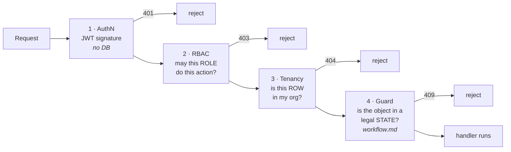

# MedDocs — Permissions (RBAC)

> **Status: complete for M1.** Who may do what, and why. This document is the **source of truth**
> for the `ROLE_PERMISSIONS` map and the `require_permission()` dependency that M2 implements.
> Roles and personas come from [`PRODUCT.md`](../PRODUCT.md); the tables come from [`erd.md`](./erd.md).
> The *state* preconditions ("may this action run on a document in *this* state?") are **not** here —
> they live in [`workflow.md`](./workflow.md) (ENG-14).

---

## 1. Authentication is not authorization

Two different questions, answered by two different mechanisms. Confusing them is the root of most
access-control bugs.

| | **Authentication (authN)** | **Authorization (authZ)** |
|---|---|---|
| Question | *Are you who you say you are?* | *Now that I know who you are — what may you do?* |
| Mechanism | JWT signature check | this document's permission matrix |
| Output | a trusted `user_id` | allow / deny |
| Failure | `401 Unauthorized` | `403 Forbidden` |

**How the JWT check actually works** (stated precisely, because "we check the signature" is only half a
mechanism): a token is `header.payload.signature`. The server takes the **incoming header + payload**,
**recomputes** a signature over them using the `SECRET_KEY` from the environment, and compares
**the signature it just computed** against **the signature carried in the token**. Both sides of that
comparison are *signatures* — the `SECRET_KEY` is an *ingredient* in the computation, never a side of it.
Match → genuine and untampered. Mismatch → forged → rejected. **No database is touched.**
Expiry (the `exp` claim) is checked separately.

---

## 2. The four gates

Every protected request passes through four gates, in order. **Passing one is not passing another.**



| Gate | Question | Enforced by | Failure |
|---|---|---|---|
| 1 · **AuthN** | Who are you? | JWT signature recompute + compare | `401` |
| 2 · **RBAC** | May your **role** perform this action? | the matrix in §4 → `require_permission()` | `403` |
| 3 · **Tenancy** | Does this **row** belong to your org? | `WHERE organization_id = <caller's org>` | `404` |
| 4 · **Guard** | Is the object in a **state** where this is legal? | workflow preconditions (ENG-14) | `409` |

**Why gate 3 returns `404`, not `403`:** answering `403 Forbidden` for another org's document *confirms
that a document with that ID exists* somewhere in the system. That is an information leak across
tenants. To a caller outside the owning org, the row **does not exist**.

---

## 3. The RBAC model

- **Permissions attach to roles, never to individual users.** There is no per-user permission grant.
- **The role lives on the `membership` row** — `memberships(user_id, organization_id, role)` — **not on
  `users`.** A person can be a `physician` in one clinic and an `org_admin` in another; the role is a
  property of the *link* between a user and an org, not of the user.
- **`memberships` has `UNIQUE(user_id, organization_id)`** → **one role per user per organization.**
- Authorization therefore reads the role from the **database**, not from the token: the JWT proves
  *who* you are (gate 1), then we load the membership for `(user_id, organization_id)` to get your
  **current** role (gate 2). This costs one indexed query per request and buys **immediate revocation** —
  demote someone and the very next request sees it. A role baked into the token would stay stale until
  the token expired.

### The four roles

| Role | Kind of authority | One-line charter |
|---|---|---|
| `org_admin` | **Administrative** | Runs the organisation: its people, its settings, its feature flags. |
| `physician` | **Clinical** | The only role that can make a medical judgement on a document. |
| `assistant` (MFA) | **Operational** | Intake and routing. Never judges clinical content. |
| `auditor` | **Oversight** | Reads the compliance trail. Writes nothing, anywhere. |

Four roles, **four non-overlapping kinds of power**. That separation is the point (§5).

---

## 4. The permission matrix

**Every cell is decided. There are no blanks.** `✅` = allowed, `❌` = denied.

### Documents

| Permission | `org_admin` | `physician` | `assistant` | `auditor` |
|---|:---:|:---:|:---:|:---:|
| `document:read_metadata` — see it in a queue (type, urgency, status, assignee) | ✅ | ✅ | ✅ | ✅ |
| `document:read_content` — open the PDF, summary, lab values | ❌ | ✅ | ✅ | ✅ |
| `document:upload` | ❌ | ✅ | ✅ | ❌ |
| `document:ask` — citation-grounded Q&A | ❌ | ✅ | ✅ | ✅ |
| `document:annotate` | ❌ | ✅ | ✅ | ❌ |
| `document:comment` | ❌ | ✅ | ✅ | ❌ |
| `document:edit` | ❌ | ✅ | ❌ | ❌ |
| `document:delete` — **soft**, guarded (see §6) | ❌ | ✅ | ✅ | ❌ |
| `document:read_history` — this document's `document_events` | ❌ | ✅ | ✅ | ✅ |

### Workflow transitions

| Permission | `org_admin` | `physician` | `assistant` | `auditor` |
|---|:---:|:---:|:---:|:---:|
| `document:triage` | ❌ | ✅ | ✅ | ❌ |
| `document:assign` — route/reassign work | ✅ | ✅ | ✅ | ❌ |
| `document:start_review` | ❌ | ✅ | ❌ | ❌ |
| `document:approve` | ❌ | ✅ | ❌ | ❌ |
| `document:reject` | ❌ | ✅ | ❌ | ❌ |
| `document:archive` | ✅ | ✅ | ✅ | ❌ |

### Patients, organisation, system

| Permission | `org_admin` | `physician` | `assistant` | `auditor` |
|---|:---:|:---:|:---:|:---:|
| `patient:create` | ❌ | ✅ | ✅ | ❌ |
| `member:manage` — invite / remove / change role | ✅ | ❌ | ❌ | ❌ |
| `flag:manage` — feature flags per tenant | ✅ | ❌ | ❌ | ❌ |
| `audit_log:read` — the org-wide compliance trail | ❌ | ❌ | ❌ | ✅ |

**Read the columns:**
- **`physician` is the only role that can `approve` or `reject`.** Clinical authority is not shared.
- **`org_admin` cannot read a document's content, approve anything, or touch a patient record.**
- **`auditor` holds `audit_log:read` alone, and holds no write permission of any kind.**
- **`assistant` does intake and routing, and never judges clinical content.**

---

## 5. The non-obvious calls, and why

These are the cells a reviewer will challenge. Each one is deliberate.

### 5.1 `org_admin` cannot `approve` — administrative power is not clinical authority

An `org_admin` is typically the practice's **office manager**. They may hold no medical qualification
whatsoever. Clicking *Approve* on an *Arztbrief* asserts **"this document has been clinically reviewed
and is medically correct."** An office manager is not qualified to make that statement, and in the German
healthcare context letting them is a liability and compliance problem.

> **"The admin can do everything" is an anti-pattern, not a feature.** Concentrating clinical +
> administrative + audit power in a single role destroys separation of duties and the audit story.
> In a compliance domain the admin should have the **least** clinical reach, not the most.

### 5.2 …but `org_admin` **can** `assign` — because continuity does not require clinical power

*What if the reviewing physician leaves, or dies, and a document is stuck assigned to them?*
A real concern — **business continuity**. But look at what is actually needed: the document must be
**re-routed to another physician**. It does **not** need to be approved by an admin.

**Routing work is an administrative act. Approving medical content is a clinical act.** The admin gets
the first and never the second. Continuity solved; separation of duties intact.

For a genuine emergency override, the pattern is **break-glass access**: explicit, time-limited, loudly
audited, reviewed after the fact. **Emergency access is an event, not a role.** Out of scope for M1 (§8).

### 5.3 `org_admin` sees **metadata** but not **content**

The `org_admin` must be able to see *that* a document exists, its type, urgency, status, and assignee —
otherwise they could not re-route a stuck one. They must **not** see the patient's diagnosis.
Hence the split of `read` into **`read_metadata`** (the queue view) and **`read_content`** (the PDF,
summary, and lab values). This is **data minimisation / need-to-know**, a core DSGVO principle:
*an office manager has no clinical reason to read a patient's Laborbefund.*

### 5.4 `auditor` can read everything relevant and **write nothing**

An auditor who can write into the system they audit is not independent. So: no comment, no annotation,
no transition, no upload. Auditors raise concerns **out of band** — via a report or an export — never by
posting into the workflow they are supposed to be judging.

### 5.5 `audit_log:read` belongs to the `auditor` **alone** — including *not* the admin

The `org_admin` is a **subject** of the audit: they invite and remove members, they flip feature flags,
and all of that is recorded. If the admin can read — let alone influence — the audit log, then
**who audits the admin?** Sole-holder access is what makes the `auditor` role independent, and frankly it
is the only thing that justifies the role existing.

**The physician does not get it either.** A doctor legitimately wants to know *"who has touched **this
document** I'm reviewing?"* — but that is **`document_events`** (the state history of one document:
triaged by X, assigned by Y), which is **clinical context** and which they **do** get via
`document:read_history`. The **`audit_log`** is a different table and a different instrument: the
org-wide, append-only record of *who did what to whom*, **including reads**. It is a compliance tool,
not a clinical one.

> **Two trails, two audiences.** `document_events` → the physician. `audit_log` → the auditor.

### 5.6 `document:ask` inherits from `document:read_content`

The RAG Q&A is a **reading aid** over a document the caller is *already permitted to read*. Denying `ask`
while allowing `read_content` protects nothing — they can simply open the PDF. **A permission denial must
be able to state its reason out loud;** this one cannot, so it is not denied.

The real Q&A risk is **not** "who may ask" — it is **retrieval scope**: the vector search must be filtered
to the caller's organisation and to documents they may read, or the *answer* leaks content the *permission*
would have refused. That is a **tenancy** bug (gate 3), not an RBAC row, and it is why every embedding
carries `organization_id`.

### 5.7 There is no hard delete

Two independent reasons:

1. **Retention obligation (Aufbewahrungspflicht).** German law requires patient records be retained for
   ~10 years. Destroying them is not merely bad practice, it is **illegal** — and this obligation
   **overrides** DSGVO's right-to-erasure for medical records.
2. **The trails are append-only.** `document_events` and `audit_log` reference documents. A hard delete
   leaves the trail pointing at a record that no longer exists.

So `document:delete` is a **soft delete**, and it exists for exactly one purpose: **correcting a
mis-upload** (wrong file, wrong patient). It is reversible and audited.

**Storage pressure is not a reason to delete anything.** Capacity is solved with retention policies and
cheaper archival tiers — an automated, law-governed system process, **not a button a human clicks**.

And note the consistency argument that settles `org_admin` = ❌ on delete: **they cannot read a
document's content at all, so they cannot possibly judge which document is a mistake.**
*You may not destroy what you are not permitted to look at.*

---

## 6. Permission ≠ guard

The matrix answers **"may this role *ever* do this?"** It does **not** answer **"is this legal *right now*?"**

| | Question | Lives in |
|---|---|---|
| **Permission (RBAC)** | may this **role** perform this action at all? | this document |
| **Guard (precondition)** | is the **object** in a state where the action is legal? | [`workflow.md`](./workflow.md) |

Example — `document:delete`. The `assistant` **holds** the permission. But the delete is only legal while
the document is still a fresh mis-upload:

```
status = 'received'   AND   assignee IS NULL   AND   no comments exist
```

**RBAC answers *who*. Guards answer *when*.** Both must pass.

---

## 7. Naming convention and the implementation contract

### 7.1 The string

```
resource:action
```

Lower snake_case, singular resource. `document:approve`, `audit_log:read`, `member:manage`.

**The scope is deliberately NOT in the string.** There is no `document:approve:own_org`.

**Why — the failure it would cause.** `document:approve` is a **static fact about a role**: *"physicians,
as a class, may approve documents."* It is the same string on every request that user ever makes.
*"Is document 999 mine?"* is a **dynamic fact about one row**, with a different answer on every request.
**A static string cannot answer a question about a specific row.**

> Dr. Schmidt, a `physician` at **Clinic A**, holds `document:approve` — legitimately.
> He calls `POST /documents/999/approve`, where document 999 belongs to **Clinic B**.
> The RBAC gate asks *"does `physician` have `document:approve`?"* → **yes** → **allowed**.
> He has just approved another clinic's patient record. **Cross-tenant breach.**

Nothing in the string could have stopped that. Only comparing **the document's `organization_id`**
against **the caller's `organization_id`** stops it — and that is gate 3, a `WHERE` clause, not a string.

### 7.2 Tenancy enforcement

Because "remember to add the `WHERE organization_id` filter" is precisely the kind of thing a human
forgets exactly once, enforcement must be **structural**, not a matter of discipline:

- every org-scoped table carries `organization_id` (already true — see [`erd.md`](./erd.md)), so the
  filter is uniform and never depends on remembering a JOIN;
- reads go through a **base query helper** that applies the org filter unconditionally;
- **Postgres Row-Level Security (RLS)** is the strong form — the database refuses to return other
  tenants' rows even if the application forgets. Candidate for ADR-002.

### 7.3 What M2 builds

The matrix in §4, transposed, becomes a **static map in code**:

```python
ROLE_PERMISSIONS: dict[str, set[str]] = {
    "physician": {"document:read_content", "document:approve", ...},
    "assistant": {"document:read_content", "document:upload", ...},
    "auditor":   {"document:read_content", "audit_log:read", ...},
    "org_admin": {"document:read_metadata", "member:manage", "flag:manage", "document:assign"},
}
```

and a FastAPI dependency guards each endpoint:

```python
@router.post("/documents/{document_id}/approve")
def approve(document_id: UUID, user = Depends(require_permission("document:approve"))):
    ...
```

`require_permission(p)` = decode JWT → `user_id` (gate 1, no DB) → load `membership` for
`(user_id, organization_id)` → role (DB) → `p in ROLE_PERMISSIONS[role]` ? proceed : `403`.

**Static map, not database-driven roles.** Customers do **not** define custom roles — there are four
fixed clinical roles. A static map is version-controlled and reviewable in a PR. (YAGNI; see §8.)

### 7.4 Backend vs frontend

`GET /me` returns the caller's flattened permission list so the UI can hide what it must:

```
{ user_id, org_id, role: "physician", permissions: ["document:read_content", "document:approve", ...] }
```

| | Backend | Frontend |
|---|---|---|
| Uses | `ROLE_PERMISSIONS[role]` | the `permissions[]` array from `/me` |
| Job | **enforce** → `403` | **decorate** → hide the button |
| If omitted | 🔥 security hole | 😕 confusing UX |

> **The frontend hiding a button is a courtesy. It is not a security control.**
> `curl` exists: any endpoint can be called directly with a valid token, without ever loading the SPA.
> **The server re-checks every request as if the frontend does not exist.**
> The `permissions[]` array is a read-only gift to the UI — it is **never** an input to a decision.
> If a client sends permissions in a request body, they are ignored and recomputed server-side.

---

## 8. Deliberate non-goals and known limitations

Stated on purpose, not overlooked.

| Item | Decision | Why |
|---|---|---|
| **Custom / customer-defined roles** | ❌ not built | Four fixed clinical roles. A static, reviewable map beats a role-builder nobody asked for. YAGNI. |
| **Platform (vendor) admin** | ❌ not in this matrix | A *cross-org* support/operator identity is a real thing, but it is **not a tenant role**. If added, it needs its own design and brutal audit logging. |
| **Break-glass emergency override** | ❌ deferred | Would be explicit, time-limited, alarmed, and reviewed after the fact — an *event*, not a role. §5.2. |
| **Per-user permission grants** | ❌ never | Permissions attach to roles only. Per-user exceptions are how RBAC rots. |
| **One role per user per org** | ⚠️ accepted limitation | `UNIQUE(user_id, organization_id)`. In a small practice the office manager may *also* work reception — our model forces the choice: they hold `assistant`, and someone else is `org_admin`. Accepted for simplicity. |
| **Delegation / "acting on behalf of"** | ❌ not built | No proxy approvals. If a physician is away, work is **re-assigned** (§5.2), not delegated. |

---

## 9. Open questions for M2

- Does `auditor` need `document:read_content`, or would **metadata + `audit_log` + `document_events`**
  suffice? Granting content access to a non-clinical role is itself a data-minimisation cost.
  *(Current call: yes, content — a compliance review that cannot see what was approved is theatre.
  Revisit if it proves too broad.)*
- Should `document:edit` exist at all once a document is `approved`? Likely a **guard**, not a permission
  (ENG-14).
- Where do **second-opinion** requests sit — a new permission, or a `document:assign` variant? (ENG-14.)
