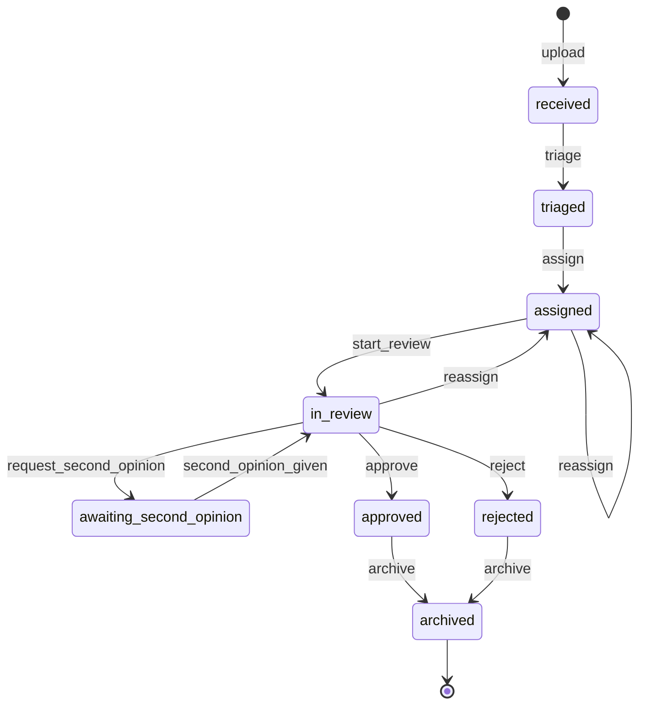

# MedDocs — Document Workflow (State Machine)

> **Status: complete for M1.** The document lifecycle, drawn *before* it is coded. **M3 implements it.**
> This document is the **source of truth** for the guarded state machine, the transition guards, and the
> `document_events` history. It is **gate 4** of the four gates in [`permissions.md`](./permissions.md) §2:
> RBAC answers *may this role ever do this?*; this document answers *is it legal on this object right now?*
> The `status` values come from the `documents.status` enum in [`erd.md`](./erd.md); the transition
> permissions (`document:triage`, `:assign`, `:start_review`, `:approve`, `:reject`, `:archive`) come from
> [`permissions.md`](./permissions.md) §4.

---

## 1. Why model this before coding it

A document does not move through arbitrary states in arbitrary order. *"Approve"* is only meaningful on a
document that has been **reviewed**; *"start review"* is only meaningful on one that has been **assigned**.
Encoding that as a **state machine** turns a class of bugs into impossibilities:

- **Illegal transitions are rejected structurally**, not by scattered `if` checks that someone forgets.
- **Every state change is one row in `document_events`** — the document's history is a by-product of the
  machine, not something we remember to write.
- **The queue and the SLA escalation read the state** — so the state must be *honest* about what is
  actually happening (this is why `awaiting_second_opinion` is a real state; see §4.4, §7).

**The rule that governs everything below: a transition not in the table in §5 is illegal → `409 Conflict`.**

---

## 2. Permission vs. guard (why this document exists)

`permissions.md` already answered *who*. It deliberately does **not** answer *when*. Both must pass.

| | Question | Lives in | Failure |
|---|---|---|---|
| **Permission (RBAC)** — gate 2 | may this **role** perform this action *at all*? | `permissions.md` | `403` |
| **Guard (precondition)** — gate 4 | is the **object** in a state where the action is *legal now*? | **this document** | `409` |

> A physician holds `document:approve` (RBAC ✅) and the doc is in her org (tenancy ✅). But the doc is
> still in `received` — nobody has reviewed it. **RBAC said yes, tenancy said yes, the guard says no.**
> → `409 Conflict`. *A valid request that conflicts with the current state of the resource.*

**Why `409` and not `422`:** `422` means the *request* is malformed — bad body, wrong types, a validation
failure. `POST /documents/999/approve` is a perfectly well-formed request. Nothing about it is invalid.
The problem is the **state of the target**, not the shape of the call. That is the textbook meaning of
`409 Conflict`.

---

## 3. What each state *asserts*

A state is a claim about the document. Naming the claim is what makes the guards obvious.

| State | Asserts | Assignee? |
|---|---|---|
| `received` | The file exists in the system. Nothing is trusted about it yet. | no |
| `triaged` | Type and urgency are **settled and trusted** (see §4.1). | no |
| `assigned` | A specific physician is **responsible** for reviewing it. | **yes** |
| `in_review` | The assigned physician has **actually started reading** it. | yes |
| `awaiting_second_opinion` | The reviewer is **blocked**, waiting on a colleague's consult (see §4.4). | yes (unchanged) |
| `approved` | A physician has **clinically signed off**: reviewed and medically correct. | yes |
| `rejected` | A physician reviewed it and decided it **does not proceed**, *with a reason*. | yes |
| `archived` | **Terminal.** The document rests here after any outcome. Retained, never deleted. | — |

**`assigned` vs `in_review` is not pedantry.** `assigned` = *"on Dr. Schmidt's desk"*; `in_review` =
*"Dr. Schmidt has opened it."* The gap between them is exactly what the **SLA timer measures** (§7): a doc
assigned three days ago that nobody has *opened* is the escalation case.

> **Soft-delete is not a state.** `document:delete` (a guarded soft-delete for correcting a mis-upload —
> see `permissions.md` §6) sets a `deleted_at` flag; it is **orthogonal** to `status`. A document has a
> lifecycle *and*, independently, may be soft-deleted. Modelling delete as a status would tangle two
> unrelated axes.

---

## 4. The five design decisions (and why)

### 4.1 `received → triaged` is done by the AI — with a human backstop rationed by risk

The AI pipeline classifies two things on upload: `doc_type` **and** `urgency`.

- **Type** (`referral | lab | letter | discharge`) is **low-stakes**. Auto-accepted when the model's
  confidence is above a threshold; below it, a human confirms. This is the
  **confidence-thresholded human-in-the-loop** pattern — automate by default, escalate to a person only
  when the machine's own certainty is low.
- **Urgency** (`routine | urgent | critical`) is the field that can **hurt a patient**. A critical
  `Laborbefund` misclassified `routine` — *with high confidence* — drops into a low-priority queue and is
  not seen for days. **High confidence is not correctness.** So anything the AI proposes above `routine`
  requires a **human acknowledgement** before the document is considered `triaged`.

Reaching `triaged` asserts *"type and urgency are settled and trusted."* Human attention is **rationed by
risk**: cheap to be wrong about type, expensive to be wrong about urgency.

### 4.2 `start_review`, `approve`, `reject` are locked to the assignee

The physician who acts must be the physician the document is **assigned to**. Clicking *approve* asserts
*"I clinically reviewed this."* If Dr. B approves what Dr. A read, the record attributes a medical
judgement to a doctor who never opened the file — a **separation-of-duties / liability** failure, not a
tidiness one. So all three clinical transitions carry `assigned_user_id = caller` in their guard.

### 4.3 Continuity is solved by **reassignment**, never by bypassing the assignee check

*"What if the assigned physician is on vacation and the case is urgent?"* — real, and already solved.
An `org_admin` (or a physician) **reassigns** the document (`document:assign`), setting a new
`assigned_user_id`. The new physician then reviews *and* approves it himself. The invariant *"the assignee
is the reviewer is the approver"* holds the entire way through. **Routing work is administrative; judging
content is clinical.** (See `permissions.md` §5.2 — the dead-doctor case.)

> Letting a non-assignee `start_review` would force us to also weaken the `approve` guard (the reviewer
> couldn't sign off on a doc still assigned to someone else) — collapsing straight back into
> *"anyone approves anything."* Reassignment costs one administrative act and keeps every guard intact.

### 4.4 Second opinion is a **first-class state**, and the consultant is **not** the reviewer

Dr. A is reviewing a hard case and wants Dr. B to weigh in *before* she commits. The model:

- **`assigned_user_id` never changes.** Dr. B is a **consultant**, not the reviewer. Dr. A stays the only
  one who can `approve`. Dr. B just adds a `comment` (a physician already holds `document:comment` on any
  doc in the org — no new permission needed) plus a **notification** tells him he was asked.
- **It is its own state — `awaiting_second_opinion` — not a boolean hidden inside `in_review`.**
  A state you cannot *see* is a state you cannot *manage*: if the doc silently sat in `in_review` for five
  days, the SLA could not tell *"Dr. A is slow"* from *"Dr. A is blocked on Dr. B"* and would escalate the
  wrong person. As a real state, the queue shows *"blocked on consult"*, the review SLA **pauses**, and a
  separate consult timer chases **Dr. B** (§7).

> **Principle:** if an operational state has a different responsible party or different SLA behaviour, it
> deserves to be a first-class state — not a flag.

### 4.5 `approved` and `rejected` are terminal → `archived`. A redo is a **new document**.

Both are review *outcomes*; both rest in `archived` (retention obligation — a document is **never**
hard-deleted; see `permissions.md` §5.7). **You never drag a document backwards.**

> Dragging a `rejected` doc back to `received` would **rewrite its history**: its `document_events` trail
> would claim it was rejected *and later* approved — the audit story becomes a lie.

If a corrected version is needed, the clinic uploads a **brand-new document** that runs its own lifecycle
from `received`. Two entities, each with **one honest, immutable lifecycle**. The new document may carry an
optional `replaces_document_id` link so the audit *connects* them — but no single entity is ever mutated
twice. `reject` always carries a **reason** (written into the event's `note`); a reject with no reason is
useless for audit.

---

## 5. The state machine



### Transition table

Every allowed transition, its trigger permission, who may fire it, the guard that must hold, and the
event it writes. **Anything not in this table is illegal → `409`.**

| # | From → To | Trigger (permission) | Actor | Guard (must be true *now*) |
|---|---|---|---|---|
| 1 | `received → triaged` | `document:triage` | `ai_classifier` service acct (auto) **or** assistant/physician (confirm) | type confidence ≥ threshold **and** urgency ≤ `routine` **or** a human has confirmed urgency |
| 2 | `triaged → assigned` | `document:assign` | org_admin / physician / assistant | `status = 'triaged'` |
| 3 | `assigned → assigned` | `document:assign` | org_admin / physician / assistant | `status = 'assigned'`; sets a **new** `assigned_user_id` |
| 4 | `assigned → in_review` | `document:start_review` | physician | `status = 'assigned'` **and** `assigned_user_id = caller` |
| 5 | `in_review → awaiting_second_opinion` | `document:assign`¹ | physician (the assignee) | `status = 'in_review'` **and** `assigned_user_id = caller` |
| 6 | `awaiting_second_opinion → in_review` | (consult resolved) | consultant comments / assignee resumes | `status = 'awaiting_second_opinion'` |
| 7 | `in_review → assigned` | `document:assign` | org_admin / physician | `status = 'in_review'`; sets a **new** `assigned_user_id` (reassignment) |
| 8 | `in_review → approved` | `document:approve` | physician | `status = 'in_review'` **and** `assigned_user_id = caller` |
| 9 | `in_review → rejected` | `document:reject` | physician | `status = 'in_review'` **and** `assigned_user_id = caller` **and** `reason` provided |
| 10 | `approved → archived` | `document:archive` | org_admin / physician / assistant | `status = 'approved'` |
| 11 | `rejected → archived` | `document:archive` | org_admin / physician / assistant | `status = 'rejected'` |

¹ Second-opinion is a `document:assign` variant (routing a consult), not a new permission — see §9.

**Reading the guards:** the recurring `assigned_user_id = caller` on rows 4, 5, 8, 9 is the
accountability invariant from §4.2 — only the assignee performs the clinical acts. Rows 3 and 7
(`reassign`) are the **only** way `assigned_user_id` changes, and they are administrative (§4.3).

---

## 6. Every transition writes one `document_events` row

The history is a **by-product of the machine**, not a thing we remember to log. On every successful
transition, M3 writes exactly one row (see `erd.md` → `document_events`):

```
(id, organization_id, document_id, actor_user_id, from_status, to_status, note, created_at)
```

- **Uniform:** one row per transition, no exceptions — including the automatic AI triage. Skipping the
  auto-transitions would leave gaps and the trail could not answer *"when was this triaged?"*
- **Append-only:** insert only, never update/delete — that is what makes the timeline trustworthy.
- This is `document_events`, **not** `audit_log`. `document_events` = *this document's* state timeline,
  read by the **physician** (`document:read_history`). `audit_log` = the org-wide *who-touched-what,
  including reads*, read by the **auditor**. Two trails, two audiences (`permissions.md` §5.5).

### The actor on an automatic transition — a **service account**, never a human, never `null`

The AI triage (row 1) has no human behind it, but `document_events` still needs an `actor_user_id`. The
model:

- A **service account** — a reserved, non-human principal in `users` with a well-known UUID and no
  password (`ai_classifier`, and later `sla_escalator`). Automatic transitions are attributed to it.
- **Not `null`** — `null` cannot distinguish *"the classifier did it"* from *"a bug left it blank."*
  A named service account makes the automated actor **first-class and queryable**.
- **Not impersonation.** Impersonation is *a human acting as another human*; using it here would attribute
  the machine's work to a real person — the exact accountability lie the whole design avoids. A service
  account *is itself*; it never pretends to be someone else.

---

## 7. SLA timers

- **The review SLA starts when a document enters `assigned`.** It measures the thing the org can act on:
  how long until a physician actually starts (and finishes) the review. A doc sitting `assigned` and
  unopened is the primary escalation case.
- **`awaiting_second_opinion` pauses the review SLA** and starts a **separate consult timer** — so
  escalation chases **Dr. B** (the blocker), not Dr. A. When it returns to `in_review`, the review SLA
  resumes.
- **Urgency scales the *duration*, not the start:** a `critical` doc gets a much shorter SLA than a
  `routine` one. (Concrete thresholds are an M3/M4 concern; not fixed here.)
- The timers are read off `status` + the `document_events` timeline — another reason both must be honest.

---

## 8. Illegal transition → `409` (the contract M3 enforces)

Any `(from_status, action)` pair **not** in §5 is refused. The handler:

1. loads the document (gates 1–3 already passed: authenticated, role-permitted, same org),
2. checks the current `status` + guard against the table,
3. on a miss → **`409 Conflict`** with a body naming the current state and the states from which the
   action *would* be legal.

**Worked example.** `POST /documents/999/approve`, doc is in `received`:

```
gate 1 authN     → ok (valid JWT)
gate 2 RBAC      → ok (physician holds document:approve)
gate 3 tenancy   → ok (doc 999 is in caller's org)
gate 4 guard     → FAIL: approve requires status='in_review', found 'received'
→ 409 Conflict   { "error": "illegal_transition", "from": "received", "action": "approve",
                   "allowed_from": ["in_review"] }
```

Other illegal examples, all `409`: approving a `triaged` doc, archiving an `in_review` doc, starting
review on a doc assigned to **someone else** (guard row 4 fails on `assigned_user_id`), re-approving an
already-`approved` doc, any transition *out of* `archived` (terminal).

---

## 9. Deferred / open questions (M3)

| Item | Decision | Why |
|---|---|---|
| **Second-opinion as its own permission** | ⚠️ modelled as a `document:assign` variant for now | It routes a consult without changing the assignee. Promote to a distinct `document:request_opinion` if the consult flow grows its own rules. (`permissions.md` §9 flagged this.) |
| **`document:edit` after `approved`** | likely a **guard**, not a permission | Editing an approved document should be illegal by *state*, not merely by role. Confirm the guard in M3. |
| **Concrete SLA thresholds per urgency** | not fixed here | Needs real operational input; belongs with the escalation worker (M3/M4). |
| **`replaces_document_id` link on a redo** | optional, not required for the machine | Connects a re-submission to the rejected original for the audit story; the two lifecycles stay separate regardless. |
| **Row-locking for concurrent transitions** | `SELECT … FOR UPDATE` on the document row | Two reviewers must not race the same transition; the M3 implementation locks the row before checking the guard. |
